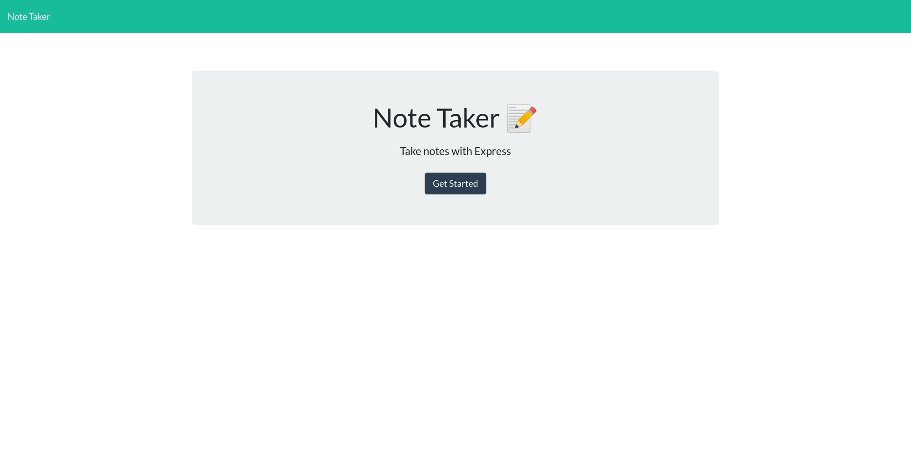
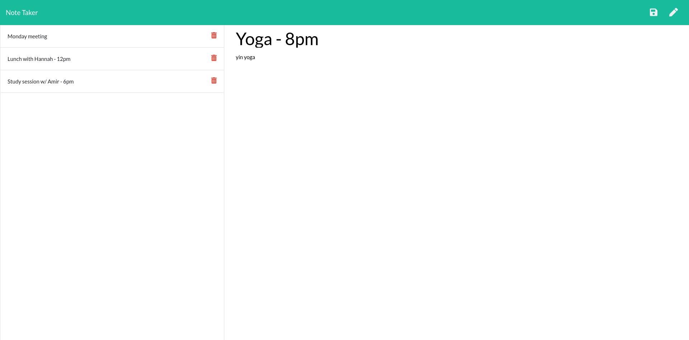

# note-taker

  [](https://www.gnu.org/licenses/gpl-3.0)

  ## Table of Contents

  - [Description](#description)

  - [Installation](#installation)

  - [Usage](#usage)

  - [Contributing](#contributing)

  - [Tests](#tests)

  - [Questions](#questions)

  - [Licenses](#licenses)

  ## Description

  A note-taking application hosted on Heroku

  ## Deployed Application

 https://note-taker-balokdecoy.herokuapp.com/

 ## Screenshots

 

 
 
  ## Usage

  Visit the URL. On the landing page, click the Get Started button. On the note-taking page, enter a title and your note text. Click the save button at the top right. Your note will save and display in a list on the left side of the screen. You can display or delete saved notes from the list at any time. Write a new note by clicking the pencil button at the top right.

  ## Contributing

  This project is free open-source software (FOSS). Please contact me if you would like to contribute. See contact details below.

  ## Tests

  ```bash
  npm test

  ```
  ## Questions

  Visit my Github profile at http://www.github.com/balokdecoy.

  If you have questions, you can reach me via email at johnniesimpson88@gmail.com.

  ## Licenses
 Licensed under [GPL v3](https://www.gnu.org/licenses/gpl-3.0)

